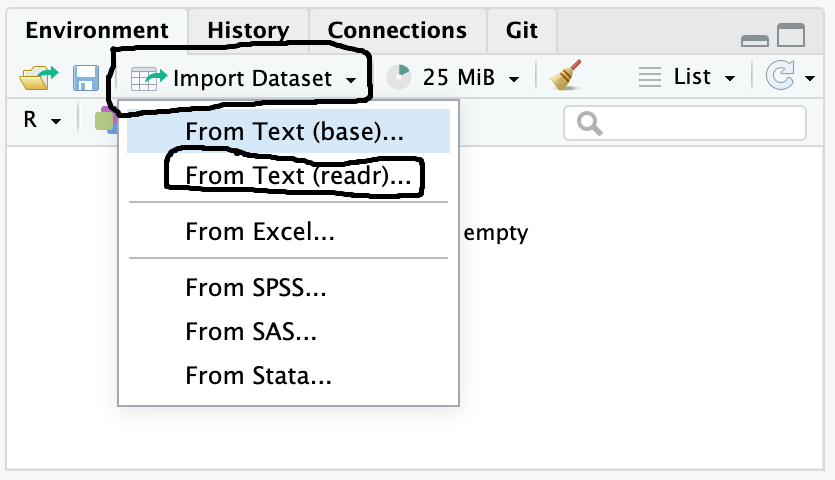
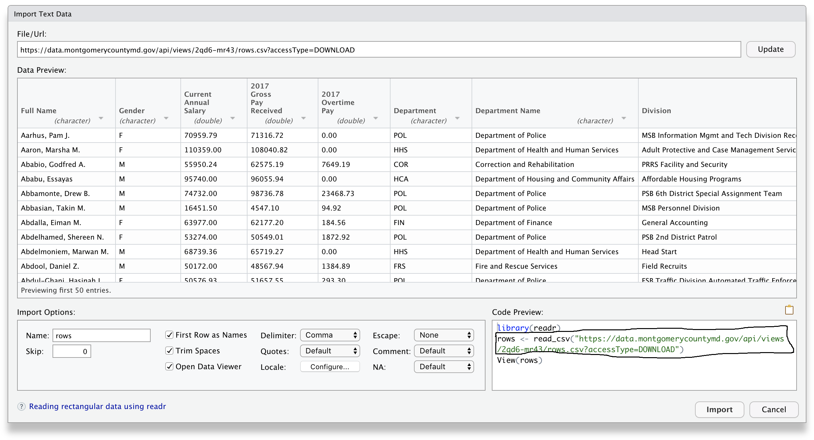

# Intro

This Tutorial will help you performing statistical analysis and visualisation task that you would normally perform with SPSS in R.

## Benefits of using R vs SPSS
- R is an open source language freely usable by everyone
- R has a quite wide range of functions and statistical models
- R is very powerful when it comes to produce data visualisation (and highly customisable)
- RMarkdown will allow you to create your own reproducible, customisable, and interactive analysis reports that can be shared and will make your research fully reproducible

## Tutorial Aims

### Section 1:
-   Learn how to download and run R studio.
-   Learn how navigate the basics of R.
-   Learn data manipulation in R.
-   Learn how to conduct statistical analyses.
-   Learn how to visualise your analyses.

### Section 2:
-   Learn how to upload your own data to R.
-   Create a data tidying script.
-   Learn how to save your tidied data (in case you want to transfer analysis to other software/supervisors).
-   A reminder of our analyses.
-   Learn how to create APA ready analysis outputs - no more copy and pasting our results!

# Section 1 

## Tools

### R, RStudio, and RMarkdown

**R** is a programming language and software environment primarily used for statistical computing and data analysis. It provides a wide variety of statistical and graphical techniques, making it a popular choice among statisticians, data analysts, and researchers. You can manipulate and analyse data using simply R but these tasks are much easier when using it is most popular user-friendly interface **R Studio**

**R Studio** is an integrated development environment (IDE) for R that enhances the user experience by providing a user-friendly interface, tools for plotting, debugging, and workspace management. 

**R Markdown** is an authoring format that enables users to create dynamic documents, reports, and presentations directly from R. It combines the power of R with the flexibility of Markdown, allowing for the integration of code, results, and narrative text in a single document. R Markdown documents can be rendered to various formats, including HTML, PDF, and Word 
**Markdown** is a simple formatting syntax for authoring HTML, PDF, and MS Word documents. For more details on using R Markdown see <http://rmarkdown.rstudio.com>.

## Getting started

The first thing you need to do is getting set up in R Studio. There are two options to do, i.e. you can download the software and run it locally on your PC or you can access R Studio online. 

Setting up online is on average easier but it will entail uploading your data online.

### Set up Locally with R Studio


- R and RStudio are separate downloads and installations. Follow the instructions below for your operating system

_Windows_

  - Download R from the [CRAN website](https://cran.r-project.org/bin/windows/base/release.htm).
  - Run the `.exe` file that was just downloaded
  - Go to the [RStudio download page](https://www.rstudio.com/products/rstudio/download/#download)
  - Under _Installers_ select **RStudio x.yy.zzz - Windows ... ** (where x, y, and z represent version numbers)
  - Double click the file to install it
  - Once it's installed, open RStudio to make sure it works and you don't get any error messages.

_macOS_

  - Download R from the [CRAN website](https://cran.r-project.org/bin/macosx/).
  - Select the `.pkg` file for the latest R version
  - Double-click on the downloaded file to install R
  - It is also a good idea to install [XQuartz](https://www.xquartz.org/) (needed by some packages)
  - Go to the [RStudio download page](https://www.rstudio.com/products/rstudio/download/#download)
  - Under _Installers_ select **RStudio x.yy.zzz - Mac OS X ... (64-bit)** (where x, y, and z represent version numbers)
  - Double-click the file to install RStudio
  - Once it's installed, open RStudio to make sure it works and you don't get any error messages.

_Linux_

  - Follow the instructions for your distribution from [CRAN](https://cloud.r-project.org/bin/linux), they provide information to get the most recent version of R for common distributions. For most distributions, you could use your package manager (e.g., for Debian/Ubuntu run `sudo apt-get install r-base`, and for Fedora `sudo yum install R`), but we don't recommend this approach as the versions provided by this are usually out of date. In any case, make sure you have at least R 3.5.1.
  - Go to the [RStudio download page](https://www.rstudio.com/products/rstudio/download/#download)
  - Under _Installers_ select the version that matches your distribution, and install it with your preferred method (e.g., with Debian/Ubuntu `sudo dpkg -i rstudio-x.yy.zzz-amd64.deb` at the terminal).
  - Once it's installed, open RStudio to make sure it works and you don't get any
  error messages.


### Access R Studio Online

Different institutions would have their own cloud-based computational notebook services that will allow you to run your code online (e.g. https://noteable.edina.ac.uk/ for The University of Edinburgh)but these services are normally available only for staff and students. 
If your institution does not have their own service you can use the cloud-based server at https://posit.co/. The basic version is free but you will have a limitation on the number of projects and collaborators you can have.

1. Go to https://posit.cloud/
2. Signup either via Gmail or GitHub
3. Go on New Project
4. New RStudio Project


### The RStudio Interface

The R studio interface has four windows: **the Console**, **the Source**, **Environment / History / Connections / Tutorial** and  the **Files / Plots / Packages / Help / Viewer**. 

Below you can find a quick explanation of what each windows contains. For a full overview of the R studio interface see https://bookdown.org/daniel_dauber_io/r4np_book/the-rstudio-interface.html 


#### The Console Window

Located in the bottom left, this is where you normally see the result of the code (but if you are using RMarkdown documents you will see the code running under each chuck of code as well). You can run code directly in here but you will normally do it from the **Source** window instead. 

#### The Source Window 

Located in the top left, this is where you are going to write your code and open any files you want to work on. If you are going to use RMarkdown, you can magnify this window and ignore any other windows except maybe the ***Environment** one because you are going to see the output of your code under each chunk

#### The Environment / History / Connections / Tutorial Window

Located on the top right, this windows contains a series of sub-windows Environment, history, Connections, Git, and Tutorial. 

In ***Environment** you are going to see all object that you will create in the R Studio Environment, from the dataset you will import to the variable you will create. Once you have create an object you can visualise it by double-clicking on it. On the top ribbon you can also see an icon ""Import Dataset" that will allow you to select the dataset you want to import into R. If you click on it and then in From Text(readr) you can navigate to where you dataset is 


If you click on it and then in From Text(readr) you can navigate to where you dataset is. 


*Reproducibility Trick* - instead of pressing Import copy and paste the bit of code that you see under Code Preview into your script (and make sure that the file will be on the same folder of the script). In this way everyone will be able to replicate your steps.

In the **History** tab you will see all the computations you will perform in the Console. 

In the **Connections** tab you can connect to external databases.

In the **Git** tab you can manage your work if you are working with Version Control (more on setting up with Git and GitHub in RStudio https://happygitwithr.com/rstudio-git-github).

In the **Tutorial** tab you can find more tutorials and material to learn R and R Studio.

#### The Files / Plots / Packages / Help / Viewer Window 
 
The bottom right windows will allows you see and open files, visualise the plots you will create, visually install and load packages (for reproducibility is always better to do it from the source code), get help about the functions and packages, visualise non static images (viewer), and visualise your presentation (if you are using Quarto https://quarto.org/). 


### Working with RMarkdown

 As we said before R Markdown is a specific type of file format designed to produce documents that include both code and text.
It allows you to simultaneously 

1: save and execute code, and 

2: produce high quality documents that include both code and text

#### Create a new markdown file

- Go on File> New File> RMarkdown
- Decide the Title, the Author and what format you want to use for the export (html, pdf, Word) and press OK

- It will open a draft file that you can modify and populate with more code 
- When you click the **Knit** button a document will be generated that includes both content as well as the output of any embedded R code chunks within the document. You can embed an R code chunk, text and even images. To run the code, click the small green arrow in the code chunk, or press `ctrl` + `enter` together.

For a more in depth overview on how to get set and create RMarkdown files see https://intro2r.com/rmarkdown_r.html and https://github.com/DCS-training/Interactive-Analysis-Reports-with-R-Markdown.github.io 

#### Importing material from a GitHub Repository

- **On Posit**
  - Go on New Project from Git Repository
  - Copy and Paste this repository URL: https://github.com/DCS-training/From-SPSS-to-R-How-to-Make-Your-Statistical-Analysis-Reproducible as the Repository URL
  - The Project directory name will filled in automatically
  - Navigate to the rmd file you want to explore

- ***On Noteable and Locally**
  - Go to File >New Project>Version Control>Git
  - Copy and Paste this repository URL: https://github.com/DCS-training/From-SPSS-to-R-How-to-Make-Your-Statistical-Analysis-Reproducible as the Repository URL
  - The Project directory name will filled in automatically but you can change it if you want your folder in Notable to have a different name
  - Navigate to the rmd file you want to explore

## Starting working with R and R Studio 

Now that we are all set up let's start exploring what we can do with R and RStudio. 
If you want to explore the basics of R and R studio more you can have a look to this introductory video [introductory video](https://media.ed.ac.uk/media/CDCS%20Text%20%26%20Data%20Analysis%20Summer%20School%202022%20-%20Intro%20to%20R%20and%20R%20Studio/1_3usrqpmj).

For anyone who want access to a useful resource to continue working through R, I recommend the [Pirates's](https://bookdown.org/ndphillips/YaRrr/t-test-t-test.html) guide to **RRRRRR**.

Please note that there are multiple ways to conduct our analyses in R. So don't be afraid if you've come across something different in the past. Just use the method you find that works best for you.


**To run the code, click the small green arrow in the code chunk, or press `ctrl` + `enter` together.**

### Dataset

Today, we will be working with the [**Palmer Penguins**](https://allisonhorst.github.io/palmerpenguins/) data set. This data set investigates the differences in flipper length, and bill length + depth, between different species of Penguins, across different island, and across the sex of Penguins.

### The Libraries/Packages we will need 

R packages are extensions to the R programming language. R packages contain code, data, and documentation in a standardised collection format that can be installed by users of R.

In R, installing a package and loading a package are two distinct processes. Installing a package involves downloading it from CRAN (the Comprehensive R Archive Network) or another repository and placing it in your local library, using the install.packages("packageName") function. This step is only necessary once per package version. Loading a package, on the other hand, is done every time you start a new R session and wish to use the functions within that package. This is achieved with the library(packageName) or require(packageName) function. Installation adds the package to your system, while loading makes the package's functions and datasets available for use in your current R session.

If you do not have the libraries already installed in your environment you need to uncomment the `install.packages` rows (remove the hashtag). Otherwise just run as it is.
To check if you have the package already you can run the cell below. If you get an error it means that the package that throws the error is not already installed. Otherwise you can go on the Packages tab and check if they are listed.


**NB:** you may get some red warning when you run it. This is normal! it is just telling you that the package was either created for a different version of R or it contains functions that have the same name of functions in other packages.


In the case of the image above if you want to use the the compose function from the the flextable package you will have to specify it by adding `flextable::` to `compose()` otherwise the system would use the compose function from **Purr** (one of the tidyverse sub-packages).
 
```{r setup, include=FALSE}
knitr::opts_chunk$set(echo = TRUE)
#install.packages("correlation")
#install.packages("DescTools")
#install.packages("flextable")
#install.packages("ggstats")
#install.packages("gtable")
#install.packages("gtsummary")
#install.packages("jtools")
#install.packages("palmerpenguins")
#install.packages("rstatix")
#install.packages("tidyverse")
#install.packages("naniar")
#install.packages("missMethods")
#install.packages("ltm")
library(correlation)#computing different kinds of correlations
library(DescTools)#collection of miscellaneous basic statistic functions and convenience wrappers for efficiently describing data
library(flextable) # Converts regression tables to pretty publication tables
library(ggstats)#Provides new statistics, new geometries and new positions for 'ggplot2
library(gtable) # Allows for custom tidy tables, which render to Latex, word, pdf, html
library(gtsummary) # Has ready made tables for summary stats
library(jtools) # Useful for generating APA ready plots
library(palmerpenguins)# Access the Penguin Dataset
library(rstatix)# performing basic statistical tests, including t-test, Wilcoxon test, ANOVA, Kruskal-Wallis and correlation analyses
library(tidyverse)#collection of R packages designed for data science
library(naniar) # Useful package for easy tools of working with missing data
library(missMethods) # Useful package for simulating and imputing missing data
library(ltm)#Analysis of multivariate dichotomous and polytomous data using latent trait models under the Item Response Theory approach
```


### Viewing our data

```{r penguins}
summary(penguins) # summary stats of our data
str(penguins) # inspecting data structure
head(penguins) # view first 6 rows 
view(penguins) # Look at the whole data set. Not advised for big data projects.
```

### Exploring data through Plots

We can also use R to generate plots, for example:

```{r }
#base R
plot(penguins$species, 
     penguins$flipper_length_mm ) 

plot(penguins$bill_length_mm,
     penguins$flipper_length_mm ) 

hist(penguins$flipper_length_mm)
boxplot(penguins$flipper_length_mm )
```

```{r}
# ggplot - grammar of graphics
## Here we have assinged our plot code to "plot_1", using the assingment arrow `<-`.
plot_1 <- ggplot(data = penguins, 
       aes(x = species, y = flipper_length_mm)) +
  geom_boxplot()

plot_1

## We can use the assigned object to further customise our code if we want to
plot_1 + facet_wrap(~sex)  + 
  labs(title = "Pretty Penguins Plot",
       subtitle = "My sister was bitten by a penguin once...",
       x = "Penguin Species",
       y = "Flipper Length"
       )


## We can also use ggplot to visualise statistical models
plot_2 <- ggplot(data = penguins, 
       aes(x = bill_length_mm, y = flipper_length_mm, color = species)) +
  geom_point() + 
  geom_smooth(method = "lm") 
  

plot_2 

plot_2 +  facet_grid(~sex ~island) +
  labs(title = "Another Pretty Penguins Plot",
       subtitle = str_wrap("No realli! She was karving her initials on the penguin with the sharpened end of an interspace toothbrush given to her by Svenge...", 80),
       x = "Bill length (mm)",
       y = "Flipper Length (mm)") + 
  theme(legend.position = "bottom")
```

## Conducting analyses

Now that we've seen some examples of data visualisation, and seen some basics of working with R, it's time to run some analyses on the data. On the menu today, we will run through: - t-tests - ANOVAS (and posthoc tests) - Correlation analyses - Regression analyses

### T - test

Our classic t-test. Our go-to tool for investigating differences between 2 groups. For this example, we are going to investigate if there is a significant difference in Flipper Length between male and female penguins. But in order to do so, we will first need to examine our data to see if it is appropriate

```{r}
summary(penguins$sex)

```

As we can see, there are some NA's in the dataset. So, unfortunately, we will need to filter out the androgynous penguins in order to run the analysis (Sorry Penguin Bowie). This will be done with the `filter()` function. And for simplicity, we will remove all other NA's from the data.

```{r}

t_test_data <- penguins %>% 
  filter(
sex != "NA's", # != is the logical operator for "does not include" - this will remove the NA's from sex.
species == "Gentoo"
  ) %>% 
  na.omit() # na.omit removes NA from our data.

summary(t_test_data$sex)
```

Now that our data is appropriately filtered for the t-test, it's time to run some quick diagnostics to determine if our assumptions are met.

#### Assumption tests

```{r}
# Checking normality
hist(t_test_data$flipper_length_mm, breaks = 30) 
shapiro.test(t_test_data$flipper_length_mm)
ks.test(t_test_data$flipper_length_mm, 'pnorm')

# Checking for equal variances - this is to determine which t test can be used
LeveneTest(flipper_length_mm ~ sex, data = t_test_data)

## As normality is not equal, the double peak in histogram may be caused by sex differences (as indicated by unequal variance). We will use ggplot to check.
```

```{r}
ggplot(t_test_data,
       aes(x = bill_length_mm, fill = sex)) +
  geom_histogram(position = "dodge") +
  facet_wrap(~sex) +
  labs(title = "Normal distribution, within each sex",
       subtitle = "We apologise for the fault in the subtitles...")

## re-running tests - normality assumed!
norm_test_m <- t_test_data %>% 
  filter(sex == "male") 
  shapiro.test(norm_test_m$flipper_length_mm)
  
  norm_test_f <- t_test_data %>% 
  filter(sex == "female") 
  shapiro.test(norm_test_m$flipper_length_mm)
```

#### The analysis

So our data meets the normality assumption, but does not meet the equal variance assumption. What do we do? Well, we opt for the Welch's t-test. Thankfully, this is already the default option for R. Additionally, many [applied statistical researchers](https://research.tue.nl/en/publications/why-psychologists-should-by-default-use-welchs-t-test-instead-of-) are calling for its use over the student t-test, as it is more robust to unequal variances, and performs just as well with equal variance. That is, it does both with less risk of misleading outputs.

```{r}

## Default Welch's 
t_test(flipper_length_mm ~ sex, data = t_test_data) # rstaxix version

t.test(flipper_length_mm ~ sex, data = t_test_data) #base R version

# Student (if needed)

t_test(flipper_length_mm ~ sex, var.equal = TRUE, data = t_test_data) # rstaxix version

t.test(flipper_length_mm ~ sex, var.equal = TRUE,data = t_test_data) #base R version
```

```{r}
### Summary statistics for reporting

t_test_data %>% 
  group_by(sex) %>% 
  summarise(mean_flipper_length = round(mean(flipper_length_mm), 2),
            sd_flipper_length =round(sd(flipper_length_mm), 2))
```

#### Plotting our results

```{r}
ggplot(t_test_data,
       aes(x = sex, y = flipper_length_mm))+
  geom_boxplot() +
  theme_apa() +
  labs(title = "Sex Differences in Gentoo Penguin Flipper Lengths",
       subtitle = "Mind you, Penguin bites kan be pretty nastiii...",
       x = "Penguin sex",
       y = "Flipper Length (mm)")

```

### ANOVA (way to analyse our data in R)

Now we have covered our T-test, let's have a dive into the ANOVA world. This time we will examine differences in flipper length between the different species of penguin.

```{r}

anova_data <- penguins %>% 
  na.omit()

```

#### Assumption checking

As previously, we need to test our assumptions for the ANOVA, else we risk misleading results. And once again, we

```{r}

LeveneTest(flipper_length_mm ~ species, data = anova_data)

## As normality is not equal, the double peak in histogram may be caused by sex differences (as indicated by unequal variance). We will use ggplot to check.

ggplot(anova_data,
       aes(x = flipper_length_mm, fill = species)) +
  geom_histogram(position = "dodge") +
  facet_wrap(~species) +
  labs(title = "Normal distribution, within each sex",
       subtitle = "We apologise again for the fault in the subtitles...")
```

```{r}
## re-running tests - normality assumed!
norm_test_a <- anova_data %>% 
  filter(species == "Adelie") 
  shapiro.test(norm_test_a$flipper_length_mm)
  
  norm_test_c <- anova_data %>% 
  filter(species == "Chinstrap") 
  shapiro.test(norm_test_c$flipper_length_mm)
  
  norm_test_g <- anova_data %>% 
  filter(species == "Gentoo") 
  shapiro.test(norm_test_g$flipper_length_mm)
```

So our data is normally distributed across the 3 species (apart from Gentoo). But it approximates normality, and so we can commit our analyses.

#### The analysis

Now it's time to define our analysis. In R, we define our ANOVA model using the `aov` function. From there, our go to formula is: `aov(outcome_variable ~ predictor_group_variable, data)`.

We then use summary to view the results, and can run the model through post-hoc tests if required.

```{r}

# Defining our model
model <- aov(flipper_length_mm ~ species, data = anova_data)

# Viewing results
summary(model)


# Conducting post hoc analyses

PostHocTest(model, 
            method = "bonferroni", 
            conf.level = 0.95, ordered = FALSE)
```

#### Summary statistics.

To get hold of our summary statistics, we need to do some data wrangling. This will make use of the `tidyverse` family of functions.

First off, we use `group_by()` to tell R which categorical variable we want our summaries to be focused on. We can use as many group variables as we like here, but make sure your order follows any hierarchical patterns of your data... Otherwise, the interpretation might be odd.

From there, we use `summarise()` to provide our summarised statistics across our chosen group variable. We choose a meaningful name, and then apply a function to our variable. As seen below, you can combine functions. We're wrapping ours in the `round()` function, so that we can decide how many decimal places we want the analysis to go to.

```{r summary_stats}

anova_data %>% 
  group_by(species) %>%  # Try playing around with the "sex" and "island" variables here. 
  summarise(mean_flipper_length = round(mean(flipper_length_mm), 2),
            sd_flipper_length =round(sd(flipper_length_mm), 2))

# task: include a `median()` summarised statistic for flipper_length. Call it median_flipper_length (if you like).

```

#### Visualising results

Now that we have conducted our ANOVA, it's time to visualise the analysis to ensure that our understanding of the analysis is accurate.

Here we will overlap different plot aspects to communicate our model assumptions. The `geom_violin()` is used to show the distributions of each group. The `geom_boxplot()` to communicate the **median** and **inter quantile range** of our data groups.

There are so many options for customising, so it can be adjusted entierly for your needs.

```{r}

ggplot(anova_data,
       aes(x = species,
           y = flipper_length_mm,
           fill = species) # fill allows us to fill an object colour by a variable. Useful here for making a more visually appealing plot.
       )+
  geom_violin( # violin plots helps us visualise distributions
             alpha = .7 # alpha adjusts transparency of points
             ) +
  geom_boxplot(alpha = .7, width = .5) + 
  theme_apa() +
  theme(legend.position = "none") + # 
  labs(title = "Penguininal Differences in Flipper Lengths",
       subtitle = "...",
       x = "Penguin Species",
       y = "Flipper Length (mm)")


```

### Correlation analyses

Now to move on to examining correlations. Once again, we will need to perform some initial data tidying to ensure we can run our analyses.

```{r}
corr_data <- penguins %>%
  dplyr::select(flipper_length_mm, bill_length_mm, bill_depth_mm) %>%
  na.omit() # we're using na.omit to remove missing values. Another useful function!

stratified_corr_data <- penguins %>%
  dplyr::select(flipper_length_mm, bill_length_mm,
         bill_depth_mm, species) %>%
  group_by(species) %>% 
  na.omit()


```

#### Assumption tests - note

For correlations, we need to inspect the residuals (the distance each point on a scatter graph has between itself and the line of best fit). So we will temporarily delay the assumption tests for now, and jump straight to our analysis.

#### Analysis

```{r}

results <- correlation(corr_data)
results
summary(results, redundant = TRUE)


strat_results <- correlation(stratified_corr_data)
strat_results
summary(strat_results, redundant = TRUE)

```

#### Back to assumption checking

For correlations, testing the assumptions is best done through visualising the data. Now before we even get to residuals, play around and compare the plots in when species is and is not accounted for. Behold the [Simpson Paradox](https://en.wikipedia.org/wiki/Simpson%27s_paradox) in its glory!

```{r}
# data visualisation

ggplot(penguins,
       aes(x =bill_length_mm, y = flipper_length_mm
          # ,color = species
           )) +
  geom_point(position = "jitter", alpha = .7 ) +
  geom_smooth(method = "lm")

ggplot(penguins,
       aes(x =bill_depth_mm, y = flipper_length_mm
           #,color = species
           )) +
  geom_point(position = "jitter", alpha = .7 ) +
  geom_smooth(method = "lm")

ggplot(penguins,
       aes(x =bill_length_mm, y = bill_depth_mm
          # ,color = species
           )) +
  geom_point(position = "jitter", alpha = .7 ) +
  geom_smooth(method = "lm")

```

### Regression analysis

And now to the final stages of this session. Let's regress to the regression. We will focus here on predicting penguin flipper length. We will also use some features of R to help you statistically determine which model best explains the variance in the penguin data.

```{r}

regression_data <- penguins %>% 
  na.omit()

```

#### Analysis

Defining our linear models in R is nice and simple. It follows a similar formula to the `aov()` model setting from above. We set our outcome variable first, and then define our predictor variables. As a bonus, R will also automatically dummy code any predictor variables for us!

For those interested in interaction/moderation analyses - R also makes this very simple. Replace the `+` with a `*` and it will add the interaction term to your model. Play around with the models below if you want to test it.

```{r}
# Step 1 - defining our models
## general pattern: lm(outcome ~ predictor, data)
model_1 <- lm(flipper_length_mm ~ bill_length_mm,
              data = regression_data )


model_2 <- lm(flipper_length_mm ~ bill_length_mm + bill_depth_mm ,
              data = regression_data )

model_3 <- lm(flipper_length_mm ~ bill_length_mm + bill_depth_mm + sex ,
              data = regression_data )

```

```{r}
# Step 2 - viewing and interpreting results
summary(model_1)
summary(model_2)
summary(model_3)
```

### Standardised Coefficients (Beta)

Unfortunatley, R does not provide standardised coefficents by default, and getting hold of them ourselves takes a little more work. But fortunatley, converting the output to get hold of standardised coefficients has been provided for you here! It makes use of the `scale()` function, which standardises your *continuous* variables by turning them into Z-scores. This allows for clearer comparison of effect sizes between coefficients.

As categorical variables are already dummy coded, they do not need to be standardised - as they already have been to some extent.

```{r}
# Step 1 - defining our models
## general pattern: lm(outcome ~ predictor, data)
standardised_model_3 <- lm(scale(flipper_length_mm) ~ scale(bill_length_mm) + scale(bill_depth_mm) + sex,
              data = regression_data )


## Compare standardised and default model. What similarities and differences do you see? 
summary(standardised_model_3)
summary(model_3)

```

### Comparing analyses

We can use the `anova()` function to statistically compare our models on the basis of sum of squares and degrees of freedom. R will then perfom an F test to help us determine if one model significantly improves upon the other.

```{r}
# Step 3 - statistically comparing models
anova(model_1, model_2, model_3)
anova(model_2, model_3)
```

#### Assumption tests

By wrapping our model in the `plot()` function, we can visualise the assumption tests underlying our analyses.

```{r}
# Step 4 - assumption tests
plot(model_1)

```

#### Visualising our data

Lets say we want to visualise our third model. We have a few different coefficents to take care of. Thankfully, ggplot allows for to play with a variety of

```{r}

summary(model_3)

ggplot(data = regression_data, # definining the data
       aes(x= bill_length_mm, # main predictor variable
            col = bill_depth_mm, # setting color as 2nd predictor
           y = flipper_length_mm) # y is our outcome variable
       ) +
  geom_point(position = "jitter", # jitter adds a teeny amount of movement to each point. Useful for overlapping data
             alpha = .7  # alpha is a measure of transparency. Useful for overlapping points
             ) +
  geom_smooth(method = "lm")+
  facet_wrap(~sex) + # Finally setting sex as another predictor by faceting
  theme_apa()+
  theme(legend.position = "right") +
  labs(title = "We can use ggplot to visualise multiple dimensions",
       subtitle = "This can be very useful for regression models",
       caption = "Just be careful not to overcomplicate it",
       x = "Bill Length (mm)",
       y = "Flipper Length (mm)",
       color = "Bill Depth (mm)"
       )

```

#### Coefficent plotting - bonus extra

We can also R to do some fancy coefficient plotting - with confidence intervals. This can be a useful way to help improve our understanding of our model through using a visual representation of our coefficents. This is achieved using the `ggstats` package, which allows for quick plots, and versatility with the `ggplot` features.

```{r}
# Coefficent plot
ggcoef_table(model_1)
ggcoef_table(model_2)
ggcoef_table(model_3)
```

The `ggstats` package also allows us to directly compare our models through the `ggcoef_compare()` function. This can be very useful in detecting and understanding any mediations and potential moderation effects that might be present in our analysis.

#### Comparing coefficent plots

```{r}
# Comparing coefficent plots

## step 1 - create a list item of our models
models <- list(
  "basic model" = model_1,
  "second model"  = model_2,
  "full model" = model_3
)

ggcoef_compare(models) # All in one plot
ggcoef_compare(models, type = "faceted") # Faceted to split by model - easier to interpret.

```

### Using regression for categorical data?! (bonus section)

Linear regressions, ANOVA's, and t-test are practically the same thing (mathematically, the ANOVA and the t-test are just specific forms of linear models).

R is more forgiving than SPSS here, as we do not need to manually dummy code our categorical variables! Less accidental errors for us.

This allows for us to play around and compare between these analyses to help improve our conceptual understanding of the analyses we're conducting.

```{r}

reg_model <- lm(flipper_length_mm ~ species ,
                regression_data)
summary(reg_model)

```

We can transform our linear model into an ANOVA as well. Setting + 0 removes the intercept, and replaces it with the reference variable. This in effect converts our analysis to an ANOVA with post-hoc tests.

Try comparing the output of the linear regression model with the `anova_style_model` below. What do you notice about the coefficents?

```{r}
# 

anova_style_model <- lm(flipper_length_mm ~ species  + 0,
                        regression_data)

summary(anova_style_model)
```

### ANOVAS and post-hoc example

Now let's re-run our ANOVA and post-hoc tests to compare with the regression outputs. What do we notice?

```{r}
 
anova_model <- aov(flipper_length_mm ~ species , regression_data)

summary(anova_model)

post_hoc <- PostHocTest(anova_model, 
            method = "lsd", 
            conf.level = 0.95, ordered = FALSE)

post_hoc
```

### Comparing linear models

Comparing outputs - look at the F value, model significance, df's and even the model coefficents.

What similarities/differences do you notice?

```{r}

 
summary(reg_model)
summary(anova_model)
summary(anova_style_model)
post_hoc
```

### Using data visualisation

Now have a look at the box plot chart from below. How does this translate to each of the model summaries above?

```{r}


ggplot(regression_data, 
       aes( x= species, y = flipper_length_mm, fill = species)) +
  geom_point(position = "jitter", alpha = .7) +
  geom_boxplot(alpha = .6)

```


# Section 2

In this second part we are going to explore how to import and organise data and how to export the results of your analysis.

## Uploading data to R

Tips: - Make sure to save your script in the same folder as your dataset. - This will make your life much easier when it comes to re-running your analysis. - With R, we can work in a way that protects your raw data and allows you to retrace your steps. - We can also use R to save new versions of our data, in any format we want. This can be very useful if you want to re-run your analyses on another software (i.e., AMOS for path analyses).

### Step 1 - File Organisation

This is a more technical aspect of using R. But, doing so will help ensure good data management practices. So whilst it may appear scary, this will help to keep your research organised, your files discoverable, and your ethics committee happy. The key concept for today is that we need all aspects of our analysis in the same folder. This includes the script we are working with, and the data set. So lets run through these steps:

1)  Create analysis folder.
2)  [Download dataset](https://github.com/DCS-training/From-SPSS-to-R-How-to-Make-Your-Statistical-Analysis-Reproducible/blob/main/~survey_data.csv), and move to our analysis folder.
3)  Save our analysis script (this document) into analysis folder.
4)  Set working directory: Click `Session` on top panel, move to `set working directory`, click `To source file location`. This will tell R to work within the folder that your current R script is saved in. 4a) Alternatively, if you are switched on with your path locations, you can use `setwd("~.../.../)` [fill in the gaps as appropriate]. However, this can be tricky. I tend to copy and paste from the above steps, as I'm prone to typos.

### Step 2 - Uploading and naming our data.

A key aspect of any data analysis is to keep our raw data unchanged, so that we can re-trace our steps, correct any errors, and make our analyses reproducible. R makes this very easy, as you would need to manually code a re-save if you wanted to overwrite your raw code... which takes deliberate effort.

Instead, it allows us to work with a copy of our data, which we can rename at a whim. It only exists within the session, until we decide to export it - which again takes deliberate effort. If however you are still concerned about protecting the integrity of your raw data, you can always create a new sub-folder to store a backup of your raw-data.

Anyhow, back to uploading the data! Within R, we have 2 ways of doing this. The first is through the graphic interface, which we can find by clicking the table icon in the `environment` tab. The second is through coding. As I am lazy/"pragmatic", I tend to use the graphic interface for my initial uploading of the data, and then I copy and paste the generated code into my script. This allows me to quickly re-run my code in future sessions without having to navigate the folder system of my computer.

```{r}
df_raw<-read_csv("~survey_data.csv")

```

## Getting meta with the meta data

Today we will be using a questionnaire-based study. The research was investigating the relationships between stressful life events, psychological distress and social support.

The data contains convenience sample of 40 individuals who attend a community group.

The group had recently run a ten-week mindfulness training course; therefore, the researcher also recorded whether each respondent had completed this course. This allows us to compare whether the course was effective in reducing symptoms of stress, anxiety and depression,

You will see that the following variables are in the data set: id, group, number of stressful events experienced in the last year (eventsscore), scores for each of the 21 items on the Depression, Anxiety and Stress Scale (DASS; dass1 - dass21), social support from significant other (SOsupport), friends (friendsupport) and family (famsupport).

The DASS-21 scale has three subscales of 7 items each. The items for each scale are:

Stress: items 1, 6, 8, 11, 12, 14, 18

Anxiety: items 2, 4, 7, 9, 15, 19, 20

Depression: items 3, 5, 10, 13, 16, 17, 21

## Data tidying in R

This is where R comes into its own. Data tidying in R is fantastic. Our script is our own personal notebook - every step of the data tidying process is recorded. And if we need to make any changes for any reason (looking at you reviewer #2...), these changes can be applied and re-run with little effort - meaning that we do not have to repeat the steps of coding and calculating any following analysis, we just get to re-run the analysis script.

All the steps required for tidying can be overwhelming. My tip is to tidy in layers. Perform each stage separately in manageable bite sized pieces. The most important aspect for this stage is not the coding itself, but rather your note keeping. Use the hash-tags `#` to note what you are doing, and why (especially if complicated).

And don't worry if you ever feel that a problem is too complex to manage. Do what you can in R, and that is good enough for now. As you build more confidence and experience, you'll be able to start coding up any additional steps that are required (and be better equipped at knowing what to search to solve your problems!).

The key part of this exercise will be the trusty pipe operator `%>%`. This is a tidyverse function that is very powerful when it comes to data tidying. It effectively allows to take an R object, and apply changes to it. It's power comes from it being readable. For now, you can translate it as **"take this object from the left, and do that function on the right to it"**.

### Data tidying script

#### Step 1 - inspecting our data

```{r}

head(df_raw) # view first 6 rows
tail(df_raw) # view last 6 rows
summary(df_raw) # View summary of data - is everything formatted correctly?


```

#### Step 2 - reformatting data

To remind ourselves of what we have done, we will use comments to summarise the process. Additionally, we will call the new data `df_1` (Actually, you can call it whatever you want. I like using numbers for my stages, as it intuitively reminds me of the processes of my tidying).

Below, we will relabel and recode the `group` variable to make it more meaningful for our interpretation. R can handle these factors, and will do the required dummy coding behind the scenes. So no more needing to double check what our numbers represent!

```{r}

df_1 <- df_raw %>% 
  mutate( group = case_when(group == "1"~ "control",
                            group == "2" ~ "experiment"),
          group = as.factor(group)
         ) # Using mutate to recode variables appropriately

summary(df_1$group)

```

#### Step 3 - Treating missing data

We may have also noticed that our dataset contains missing values. Thankfully R has loads of useful packages to make working with missing data much easier. Getting to know what's missing in your life/data is very important to ensure that our analysis is accurate. For today, we will give a quick and easy overview to working with the missing data, using the `naniar` package.

```{r}

pct_miss(df_1) # provides percentage of total missing data
miss_case_summary(df_1) # breaks down missing data percentage by each case
vis_miss(df_1) # Visually inspect data 

```

We can see that case 41 and 42 have a lot of missing entries from the above summary. These participants need to be removed.

```{r}
df_2 <- df_1[-c(41,42), ] # using base R to manually remove participants, using the minus symbol. 

pct_miss(df_2) 
miss_case_summary(df_2) 
vis_miss(df_2)  
gg_miss_var(df_2) # using gg_miss_var to visualise missing data by variable.
```

For the others, we will impute based on row-mean values within each subscale. Whilst not as sophisticated as methods such as Multiple Chained Imputation Equations, it is much simpler to conceptually understand. It is also a robust alternative that has comparable effectiveness for dealing with missing data in psychometric subscales under conditions of low % Missing Completely At Random data [(Parent, 2012)](https://journals.sagepub.com/doi/full/10.1177/0011000012445176). The missing data for today was simulated to match these conditions.

Other options are more appropriate for robust missing data analysis, and examples of working with such instances of missing data can be found in our [CDCS Much Ado About Nothing](DCS-training/Much-ado-about-nothing-missing-data-in-research: Repo for the Much ado about nothing workshop. (github.com) github materials.

Conveniently, we will notice that all of our missing variables all belong to the depression subscale... How magically convenient! This may/will not be the case for real data, but it is helpful for today, as it stops us being overwhelmed with code.

```{r}

Depression_data <- df_2  %>%  
  dplyr::select(dass3, dass5, dass10, dass16, dass17, dass21)

#Step 2 - applying rowwise imputation to the selected data


Depression_fix <- apply_imputation(Depression_data,
                                   FUN = mean,
                                   type = "rowwise")


#Step 3 - updating dataset with imputed data - do this by subscale to help brain manage.
 df_3 <- df_2 %>% mutate(
  dass3 = Depression_fix$dass3,
  dass5 = Depression_fix$dass5,
  dass10 = Depression_fix$dass10,
  dass16 = Depression_fix$dass16,
  dass17 = Depression_fix$dass17,
  dass21 = Depression_fix$dass21,
)

```

#### Step 4 - Creating composite variables

```{r}
## Task - compute the DASS subscales. Stress has already been calculated in the code below as an example. Don't forget to use a comma between each command in the `mutate()` function.
 
# Stress: items  dass1, dass6, dass8, dass11, dass12, dass14, dass18
# 
# Anxiety: items  dass2, dass4, dass7, dass9, dass15, dass19, dass20
# 
# Depression: items  dass3, dass5, dass10, dass13, dass16, dass17,  dass21


#Uncomment the tip below and complete the missing bits

#df_4 <- df_3 %>% 
  #mutate( # Using mutate to create composite variables
    #stress = dass1 + dass6 + dass8 + dass11 + dass12 + dass14 + dass18,
    #anxiety = ... , 
   # depression = ...
 # ) 

```


Below is the solution of the exercise above
```{r}
## Results

df_4 <- df_3 %>% 
  mutate( # Using mutate to create composite variables
    stress = dass1 + dass6 + dass8 + dass11 + dass12 + dass14 + dass18,
    anxiety = dass2 + dass4 + dass7 + dass9 + dass15 + dass19 + dass20 , 
    depression = dass3 + dass5 + dass10 + dass13 + dass16 + dass17 + dass21
 ) 

```

#### Step 5 - Filtering data

Here we will be performing the bane of most researchers - filtering. This includes removing suspect bots, removing duplicates, removing participants who did not finish survey, and removing outliers.

Today, we will focus on removing outliers on the basis of Z-scores. This is when data is standardised, so that the mean value is 0, and each participant score is converted to their relative standard deviation position. Any participant with entries with less than -3, or greater than +3 can be considered to be a large/influential outlier [(Osbourne & Overbray, 2004)](https://scholarworks.umass.edu/cgi/viewcontent.cgi?article=1139&context=pare). As such, there is justification to remove them from the data. Prior to this, we need to inspect our data.

```{r}
summary(df_4) # Using summary to inspect our data

# Using plots to visually inspect our data
boxplot(df_4$SOsupport) # Any outliers in boxplot?
hist(df_4$anxiety) # How is the data distributed? (Does it make sense regarding the literature?)

## Task - visually inspect the outliers and distribution of the stress and depression sub scales below:


```

Now that we have visually inspected our data, we can apply the code to remove our outliers.

```{r}

# Creating Z score of study measures - useful for subjectively removing outliers. 
df_5 <- df_4 %>% 
  mutate(Z_score_life_events = scale(eventsscore),
         Z_score_anxiety = scale(anxiety),
         Z_score_stress = scale(stress),
         Z_score_depression = scale(depression),
         Z_score_SOsupport = scale(SOsupport),
         Z_score_friendsupport = scale(friendsupport),
         Z_score_famsupport = scale(famsupport)
         ) 

summary(df_5) # Which variable has a Z-score that breaks our +3/-3 boundary?
  
### Note: Z-scores between -3 and +3 are recommended as cuttoff for non-exponential data. May not always be appropriate, so know your data first. 

#We can use the results of the above summary to identify the variable that needs filtering.


df_6 <- df_5 %>% filter(
         Z_score_SOsupport <= 3 ,
         Z_score_SOsupport >= -3
  )

summary(df_6)
boxplot(df_6$SOsupport) # New boxplot
boxplot(df_4$SOsupport) # Boxplot with outliers
```

#### Step 5 - Saving a copy of our analysis ready data.

Now that our data is ready, we can save a copy. This can help us save time on future projects, by saving us the hassle of needing to re-run our tidying script every time. It also allows for communication of our data with others who might not want to go through the hassle/pain of data tidying. Because our source file is already set, our newly saved data will pop straight into our folder.

For today, we will work with CSV as the file format. It's the recommended format, as it can be opened with multiple pieces of software. Data safety, it is also preferred as the file format is safe from system updates/software disengagements. This is because csv files keep data organised through the simple yet effective **comma** **separated** **values** (aka: **C.S.V**). This also allows them to store much larger datasets in comparison to SAV and xlsx file formats, as there is less complications to manage.

This makes it a commonly used file format in data science activities... So if you ever want to make life difficult for anyone who might steal personal data, make sure to include plenty of comma's in your responses. It will beautifully vandalise their dataset.

```{r}

#Make sure to check your folder to view your data. Open it up in excel or SPSS if you like! 

write.csv(df_6, "~tidy_data.csv")

```

After the above step is complete, we can now re-run our analysis without having to retrace the steps of cleaning every time. In my own practice, I keep a separate script for tidying and a separate script for analysis. I will then use the tidied data for my analysis. Now it is time for a quick break, and then we will continue in our part-2 analysis document.

#### References

Osborne, J. W., & Overbay, A. (2004). The power of outliers (and why researchers should always check for them). Practical Assessment, Research, and Evaluation, 9(1), 6.

Parent, M. C. (2013). Handling item-level missing data: Simpler is just as good.*The Counseling Psychologist*,*41*(4), 568-600.


## Exporting your work

Finally We are going to quickly learn about how R can be used to render documents. This is done using the `Knit` button. To tidy our end document, we will also use some extra commands in our code chunks. The `echo=FALSE` is used to prevent our code from being rendered. Meanwhile, `message = FALSE` is used to prevent any warning messages from being rendered.

```{r, echo=TRUE, message = FALSE, results= FALSE}
#code to upload our newly saved file into R.
df_tidy <- read_csv("~tidy_data.csv") %>% mutate(group = as.factor(group))
summary(df_tidy) 
```

## Running and reporting analyses

Now that the hard work of preparing our data is complete. We can run our analyses! Today we will perform t-tests to compare the effect of the intervention on depression, anxiety and stress.

From there, we will perform a regression analysis to predict depression scores whilst controlling for exposure to stressful life events, social support, and the intervention.

We will also use this to demonstrate how we can use R to generate our analysis reports. So no more copy and pasting. Just smoooooooth sailing.

Here we will be taking advantage of the `flextable` and `gtsummary` packages to conduct and report our statistics. These package makes it super easy to generate publication ready tables, and it can be rendered into Word documents thorugh R!

For more information on how to use the package, please check out the `flextable` [vignettes](https://ardata-fr.github.io/flextable-book/) and the `gtsummary` [vignettes](https://www.danieldsjoberg.com/gtsummary/articles/tbl_summary.html).

The code might look a little intimidating, but we will walk you through it so that you can also use this for your own analysis.

For each analysis, we will display the raw version and the tidied version. We will also show you how to render your analysis to finish the session.

## Summary Statistics

The code for the summary statistics table has been set to display most of the common descriptive summary statistics. Any columns that are not needed can be deleted manually in the rendered word document (Or by digging into `get_summary_stats()` by looking up the [R documentation](https://www.rdocumentation.org/packages/rstatix/versions/0.7.2/topics/get_summary_stats)). 


**NB** If you are running the cell below to generate a report that will contains only the output tables make sure to change `echo=TRUE` in the header of the markdown cell into `echo=FALSE`.

```{r, echo = TRUE, message= FALSE}

table <- df_tidy %>%
  dplyr::select(stress, anxiety, depression, eventsscore, SOsupport) %>%  # Select relevant columns
  tbl_summary(
    type = all_continuous() ~ "continuous",  # Specify that all selected columns are continuous
    statistic = all_continuous() ~ "{mean} ({sd})",  # Customize the statistics
    label = list(stress ~ "Stress Score",    # Optional: Customize labels for better readability
                 anxiety ~ "Anxiety Score",
                 depression ~ "Depression Score",
                 eventsscore ~ "Event Score",
                 SOsupport ~ "Social Support")
  )


as_flex_table(table)  # Converts table to flextable, which makes it prettier and allows for rendering into Word. 
 

```

### Cronbach's alphas

This is probably the most complicated part of the worksheet, as it requires using a combination of different functions. However, we have tried to compile the code so that you can copy, paste and adjust to your own needs.

```{r, echo = TRUE, message = FALSE}

# Compiling alphas

## Step 1: compiling subscale variables
stress_alpha <- df_tidy %>% dplyr::select(dass1, dass6, dass8,
                                       dass11, dass12, dass14, dass18)
anxiety_alpha <- df_tidy %>% dplyr::select(dass2, dass4, dass7,
                                        dass9, dass15, dass19, dass20) 
depression_alpha <- df_tidy %>% dplyr::select(dass3, dass5, dass10, 
                                           dass13, dass16, dass17, dass21) 

## Step 2: Running the cronbach.alpha test, and collecting only the score.
## If the commands below are not working, run `instal.packages("ltm")` in the console first. 

str_alpha_value <- ltm::cronbach.alpha(stress_alpha)[[1]]
anx_alpha_value <- ltm::cronbach.alpha(anxiety_alpha)[[1]]
dep_alpha_value <- ltm::cronbach.alpha(depression_alpha)[[1]]


## Step 3:Creating Subscale names and cronbach alpha values objects - make sure values align with names

alpha_values <- c(str_alpha_value , anx_alpha_value, dep_alpha_value)

Measure_name <- c("DASS Stress", 
              "DASS Anxiety",
              "DASS Depression")

## Step 4: Creating a pretty table
data.frame(Measure_name, alpha_values) %>% # Choosing our objects from step 3
  mutate(alpha_values = round(alpha_values, 2)) %>% # Rounding to 2 decimal places
  dplyr::rename( `Measure` = Measure_name, # Renaming so we can include spaces
    `Cronbach alpha` = alpha_values ) %>% 
  flextable() # Using flextable() to make prettier table that renders to word.
```

## T-test report

### Raw results

```{r, echo=TRUE, message = FALSE}
t_test(stress ~ group, data = df_tidy)
```

### Publication ready(er) results

```{r, echo=TRUE, message = FALSE}
  df_tidy %>%
  dplyr::select(group, anxiety, stress, depression) %>%
  tbl_summary(by = group, 
              missing = "no",
              statistic = list(all_continuous() ~ "{mean} ({sd})")) %>%
  add_p(everything() ~ "t.test") %>%
  modify_header( # header needs to be modified to display test statistc and df 
    statistic = "**t-statistic**", 
    parameter = "**df**"
  )  %>%
  # add a header to the statistic column, which is hidden by default
  modify_fmt_fun(c(statistic , parameter) ~ style_sigfig)
```

## Correlation analysis

### Rough results

```{r, results = "asis", echo = TRUE, message = FALSE}

cor_data <- df_tidy %>% 
  dplyr::select( anxiety, stress, depression, eventsscore , SOsupport)

# Calculate correlation
results <- correlation(cor_data)


# Capture the summary output
summary_output <- capture.output(summary(results, redundant = TRUE))

# Wrap the output in markdown code block to avoid header interpretation
cat("```\n", paste(summary_output, collapse = "\n"), "\n```")

```

### Publication ready(er) results

Please note that the correlation matrix is left with redundant values. This is to allow you to decide if you want to manually display the lower or upper triangle. Also, a bug in the `correlation` package rearranges the display in a displeasing manner when `redundant = FALSE`. But thankfully, we can edit our output to our needs in the rendered word document.

```{r, results = "asis", echo = TRUE, message = FALSE}

 df_tidy %>% dplyr::select( anxiety, stress, depression, eventsscore , SOsupport) %>%
    rename(`Anxiety` = anxiety ,
           `Stress` = stress,
           `Depression` = depression,
           `Stressful Life Events` =  eventsscore,
           `Significant Other Support`=  SOsupport) %>% 
  correlation::correlation() %>% 
  summary(redundant = TRUE) %>%
  display()

```

## Regression analysis

```{r, echo = TRUE, message = FALSE}
# Setting the model
model <- lm(depression ~ group + eventsscore + SOsupport, df_tidy)

```

### Raw results

```{r, echo = TRUE, message = FALSE}
# Ugly (but useful) results 
summary(model)

```

### Publication ready(er) results

I have recently discovered the `flextable` package, and it is amazing! It will convert your model into a publication ready format in word with minimal effort. Simply take your defined model, and wrap it in the `as_flextable()` function. More information on `flextable` can be found [here](https://ardata-fr.github.io/flextable-book/index.html).

```{r, echo = TRUE, message = FALSE}
# Pretty results 
model <- tbl_regression(model)
as_flex_table(model)
```

### Publication ready plot

And what use is a fancy table without a fancier plot?! APA guidelines are a little hazy when it comes to plot standards, but here is a good estimate. The title, subtitle and caption have been left empty here, as sometimes it is more useful to edit this within word (sometimes...).

```{r, echo = TRUE, message = FALSE}
#Generating plot
 plot <- ggplot(df_tidy,
                aes(x = eventsscore, y = depression, col = group)
                ) +
  geom_point(alpha = .7, position = "jitter")+
  geom_smooth(method = "lm", se = FALSE) 
  

#Adding labels and APA theme
  plot +
    labs(x = "Exposure to stressful life events",
         y = "Depression score (DASS)",
         col = "Condition") +
     theme_apa(legend.pos = "right", 
               legend.use.title = TRUE) 
    

```

## Finishing session

If you are running this on R Markdown you can now click on `Knit` to prepare your word document with all the prepared analyses.


**[Go Back to the Tutorial Homepage](https://dcs-training.github.io/)**
